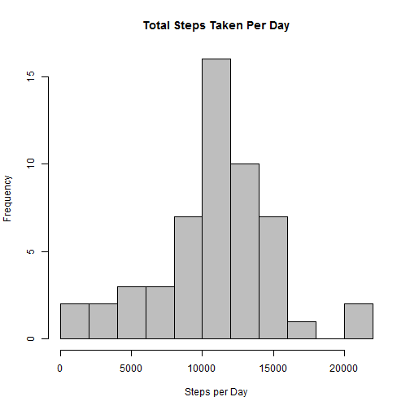
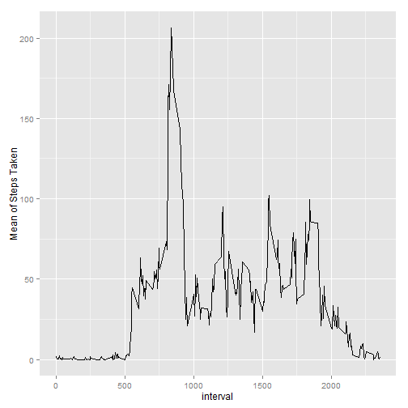
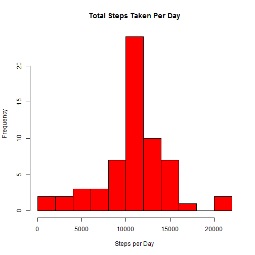
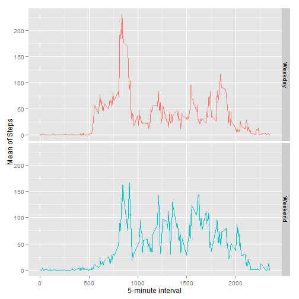

# Reproducible Research:  PA1


## Loading packages

```r
require(data.table)
require(dplyr)
require(ggplot2)
require(lubridate)
```

## Loading and preprocessing the data

```r
dataset <- as.data.table(read.csv("./data/activity.csv"))
dataset$date <- as.Date(dataset$date, format="%Y-%m-%d")
dataset$wday <- as.factor(wday(dataset$date, label=T,abbr=T))
```


## I.  What is mean total number of steps taken per day?

```r
df1 <- dataset %>%
    group_by(date) %>%
    summarize(total_steps = sum(steps, na.rm = TRUE)) %>%
    filter(total_steps > 0)
```

### 1. Histogram of total number of steps taken each day

```r
hist(df1$total_steps, col="grey", breaks=10, 
     xlab="Steps per Day", main="Total Steps Taken Per Day")
```

 

### 2a. Mean steps per day

```r
mean(df1$total_steps)
```

```
## [1] 10766.19
```

### 2b. Median steps per day

```r
median(df1$total_steps)
```

```
## [1] 10765
```


## II.  What is the average daily activity pattern?


```r
df2 <- dataset %>%
    group_by(interval) %>%
    summarize(mean_steps = mean(steps, na.rm = TRUE))
```

### 1. Time series plot

```r
qplot(interval, mean_steps, data=df2, geom="line",
    ylab="Mean of Steps Taken")
```

 

### 2. Which 5-minute interval contains the maximum number of steps on average?

```r
max_steps <- max(df2$mean_steps)
df2max <- df2 %>%
    filter(mean_steps == max_steps)
print(df2max)
```

```
## Source: local data table [1 x 2]
## 
##   interval mean_steps
## 1      835   206.1698
```
08:35 has the max on average steps with 206 average steps.


## III. Imputing missing values

### 1. Report total number of missing values

```r
sum(is.na(dataset$steps))
```

```
## [1] 2304
```

### 2-3. Merge df2 with dataset and replace NAs with the mean of the respective 5-min interval.
Create new dataset df3 with missing data filled in.

```r
df3 <- merge(dataset, df2, by="interval", sort=FALSE)
df3$steps[is.na(dfNA$steps)] <- df3$mean_steps[is.na(df3$steps)]
df3 <- select(df3, -mean_steps)
```

### 4. Compare values against original dataset


```r
df3b <- df3 %>%
    group_by(date) %>%
    summarize(total_steps = sum(steps, na.rm = TRUE)) %>%
    filter(total_steps > 0)
```

### Histogram of total number of steps taken each day

```r
hist(df3b$total_steps, col="red", breaks=10, 
     xlab="Steps per Day", main="Total Steps Taken Per Day")
```

 

### Mean steps per day

```r
mean(df3b$total_steps)
```

```
## [1] 10766.19
```

### Median steps per day

```r
median(df3b$total_steps)
```

```
## [1] 10766.19
```

Do the values differ?  
What is the impact of imputting missing data on the estaimtes of the total daily number of steps?

Mean values are the same.
The median value is only slightly higher than the original dataset, so both very similar.
The histogram/distribution appears a bit more normal when missing added.


## IV. Are there differences in activity patterns between weekdays and weekends?


```r
##Create new factor variable with two levels - "weekday" and "weekend"
dfdays <- data.table(wday=c("Sun","Mon","Tues","Wed","Thurs","Fri","Sat"),
        dayend=c("Weekend","Weekday","Weekday","Weekday","Weekday","Weekday","Weekend"))

df4 <- merge(df3, dfdays, by="wday", sort=FALSE)
```


```r
##Group and summarize
df4b <- df4 %>%
    group_by(dayend, interval) %>%
    summarize(mean_steps = mean(steps, na.rm = TRUE))
```


```r
##Create new time series plot
qplot(interval, mean_steps, data=df4b, facets=dayend ~., color=dayend, geom="line",
    xlab = "5-minute interval", ylab= "Mean of Steps") + theme(legend.position="none")
```

 
